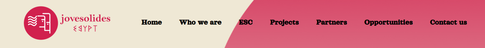

# Jovesolides-Egypt
Wordpress website

## Description

This is a project developed in WordPress, using NicePage plugin, based on a Figma design. The project was built initially locally and, after, moved on a server.

## Instalation

The website page can be accessed here [Jovesolides Egypt](https://alex.jove-egypt.com).

## Usage

The main page, Home, displays the menu of the website and info about the company.

Next, on the menu, the user can navigate between different pages as needed.

## Credits

[Alexandra Ionescu](https://github.com/ionescuea)

## License

Licensed under the [MIT](LICENSE) license.
